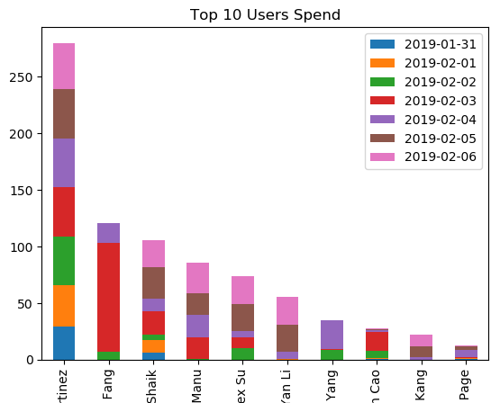

# AWS cost explorer API
------

This project is to generate an AWS cost and usage report for aws billing analysis. Boto3 and AWS cost explorer API are used here. The generated report with charts/visulizations can be opened with excel. You will see the content in this report like this:    

| AWS_Account | 1/31/19 | 2/1/19 | 2/2/19 | 2/3/19 | 2/4/19 | 2/5/19 | 2/6/19 | Sum | 
| --- | --- | --- | --- | --- | --- | --- | --- | --- | 
| 1111 | 1.0 | 2.0 | 3.0 | 4.0 | 5.0 | 6.0 | 7.0 | 28.0 | 
| 2222 | 3.0 | 1.0 | 5.0 | 4.0 | 2.0 | 6.0 | 7.0 | 28.0 | 
| 3333 | 7.0 | 5.0 | 1.0 | 6.0 | 2.0 | 4.0 | 3.0 | 28.0 | 
 
 
 Top ten spent aws accounts are seleted and made chart like this(more visulizations products can be built based on needs):    

  

 The script is written in python and you can run the following commands to execute it.  
 > $ # log into aws console  
 > $ aws configuration  
 > $ # we want to track 7 days cost and usage, the days can be change from 1 to 30 days  
 > $ ./aws-cost-explorer-api.py --days=7  

**References**  
[AWS Boto3 Document](https://boto3.amazonaws.com/v1/documentation/api/latest/guide/quickstart.html#installation)   
[AWS cost explorer API](https://docs.aws.amazon.com/awsaccountbilling/latest/aboutv2/ce-what-is.html)